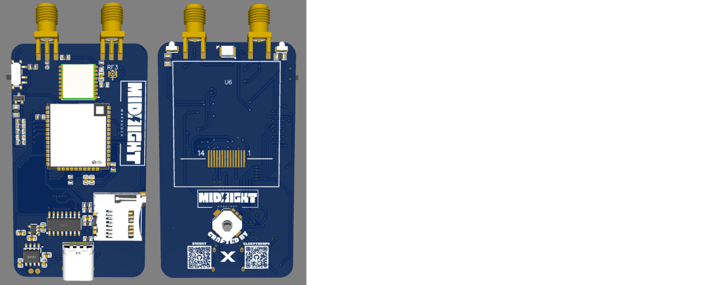
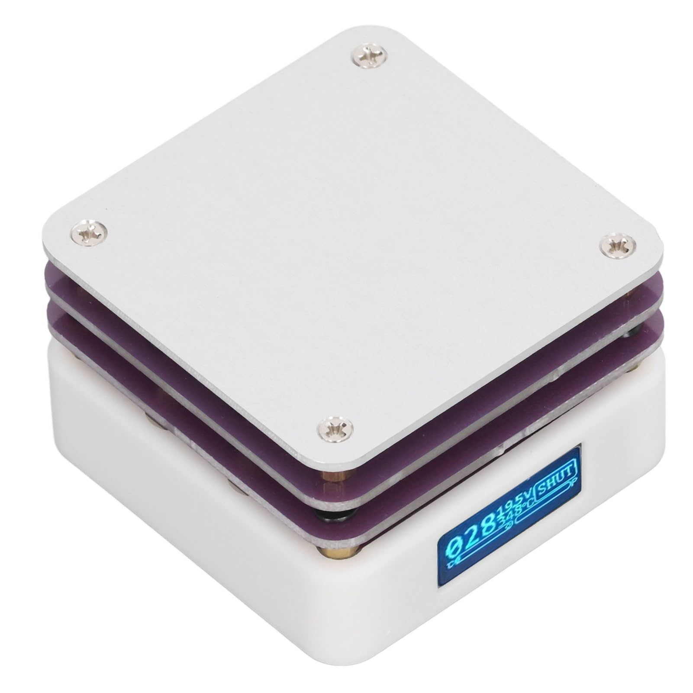
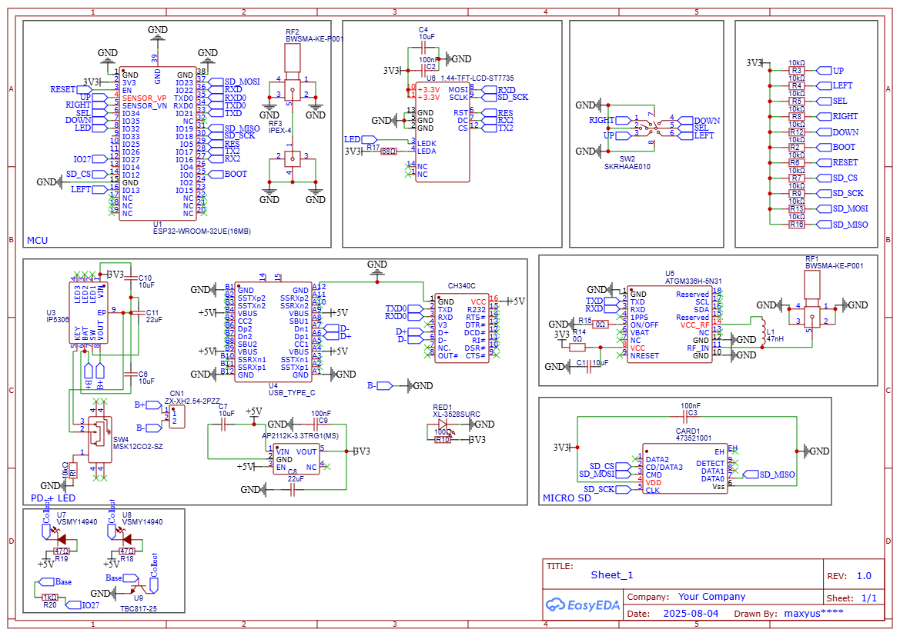

# 🌙 Midnight.Marauder

**Midnight Marauder** — basically a **Marauder Mini**, but modded.

Marauder MINI >>https://github.com/justcallmekoko/MarauderMini

This project was made by **sleepymorph**, with thanks to **D1Goat** for auto-routing, component placement, and help with IR LEDs.

Open-source schematics and the `.gerber` file are included so you can order and assemble it yourself.

---

## ⚠️ Note

This project is **not complete** and hasn’t been fully tested yet.  
If you want to help, you can order a PCB, assemble it, test it, and help troubleshoot any issues.

---

## 🚀 Features

- IR built-in: Two **VSMY14940** powerful SMD IR LEDs  
- Custom battery: solder **any battery** you want (1000 mAh+)  
- GPS module: **ATGM336H-5N31**  
- Power management: right-angled switch, USB-C, **IP5306**, battery pins, etc.  
- Micro SD card slot: supports up to **32 GB**  
- Antenna headers: Two **BWSMA-KE-P001** right-angled (2.4 GHz & GPS)

> Recreated from **Marauder Mini** by JustCallMeKoko, but modded for extra features.

---

## 🖼 PCB Preview

### Dual-Side View

---

## 💸 How to Get It

The cheapest method is **hand-soldering**:

1. Order the PCB from **JLCPCB** (~$2).  
2. Use a **mini hotplate** with **low-melting solder** (liquid type).  
3. Tip: the **screen is the hardest part** due to flexible cables.

### Example Hotplate Setup

---

## ⚙️ How to Assemble

### Required Parts:

- 2 antennas (2.4 GHz & GPS)  
- Micro SD card (up to 32 GB)  
- IPEX-to-IPEX wire

### Assembly Steps:

1. Connect one end of the IPEX wire to the ESP and the other to **RF3**, near the right antenna on the back side.  
2. Insert SD card, connect antennas, and flash firmware.

---

## 📝 Schematics

Schematics? Sure.  

---

## 💡 Summary

**Midnight Marauder** — Marauder Mini, but modded and upgraded.

⭐ If this project gets stars, I may open a **PCBWay build option**!

---

## 💬 Contact

Need help? DM me on **Discord: sleepymorph**
